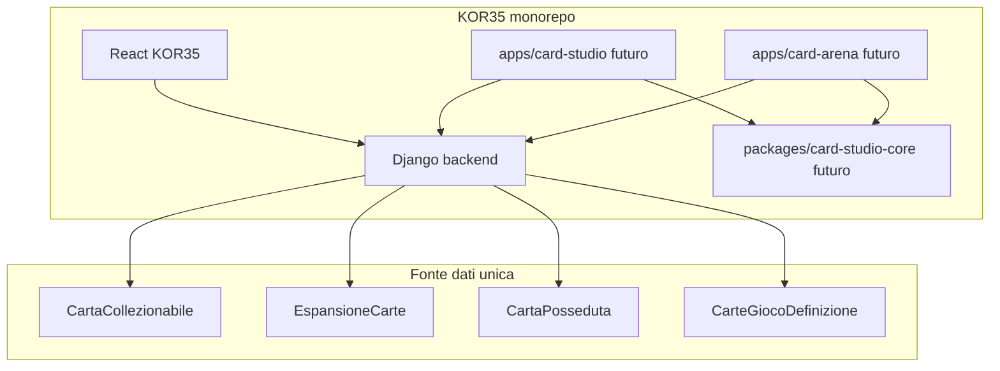

# 01 — Architettura piattaforma

## Vista d'insieme



## Triangolo MSE (Card Studio)

Magic Set Editor organizza:

- **Game** — regole globali, tipi carta, keyword system
- **Style** — template visivo (layer, font, dimensioni)
- **Set** — carte concrete in un'espansione

In KOR35:

| MSE | Modello KOR35 |
|-----|----------------|
| Game | `CarteGiocoDefinizione` |
| Style | `CarteStudioTemplate` |
| Set | `EspansioneCarte` + `CartaCollezionabile` |

## Triangolo GCCG (Card Arena)

GCCG (desktop C++) separa:

- **Lobby / matchmaking**
- **Collection / deck builder**
- **Table state + action protocol**

In KOR35:

| GCCG | Modello / servizio KOR35 |
|------|---------------------------|
| Player identity | `CartePlatformGiocatore` (+ `Personaggio` bridge) |
| Collection | `CartaPosseduta` (già esistente) |
| Deck | `MazzoDuello` + `arena_deck_spec` |
| Rules | `CarteArenaRuleset` + `carte_duello_service` |
| Match | `DuelloCarte` (evolverà verso `duel_state_v1`) |

## Repo future (non ancora create)

```
kor35-1/
  apps/card-studio/          # SPA editor stampa
  apps/card-arena/           # SPA gioco
  packages/card-studio-core/ # parser MSE, mapper, validazione contratti
  backend/                   # API + sync (questo repo)
```

Card Studio e Card Arena sono **invocabili standalone** (URL propri) e **embedded** da KOR35 via iframe o route condivisa + token sessione.

## URL previsti

| Fase | URL | Note |
|------|-----|------|
| 1 | `www.kor35.it/cardeditor` | path sotto nginx stesso frontend |
| 2 | `studio.kor35.it` | subdomain opzionale |
| Arena | `www.kor35.it/cardarena` | stesso pattern |

Nginx serve build statica; API sempre relative `/api/…`.

## Sync edge

Tutti i modelli platform hanno `sync_id` + `updated_at` → inclusi automaticamente nel registry edge sync. Dopo ogni migrazione: `make migrate` su prod, mirror, dev-office.

## Cosa NON fare

- Non duplicare `CartaCollezionabile` in tabelle Studio/Arena
- Non portare codice GPL da MSE2
- Non reimplementare il client GCCG in C++
- Non usare URL assoluti nel frontend
